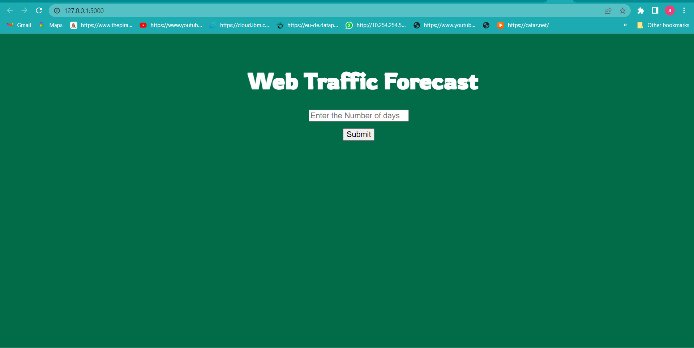

# Website-Traffic-Forecasting

--------------------------------

### Software and Tools Requirements
1. [GitHub Account](https://www.github.com) 
2. [Pycharm IDE](https://www.jetbrains.com/pycharm) 
3. [GitCLI](https://git-scm.com/downloads)
4. [python]()
5. [Anaconda]()
6. [jupyter]()
9. [numpy]()
10. [Pandas]()
11. [statsmodels]()
12. [Matplotlib]()
______________________

This is an End to End Project where a web app is created to show how the model works and
interacts with the a front end structure.

The screenshot of the web app are given below:

The interface takes the number of days to be forecasted as input 
and will show a plot on a new page where the forecasted data is shown.The
image below is an example of forecasted data for 10 days

The forecasting was done using ARIMA algorithm.ARIMA has three 
parts AR-I-MA,AR means Auto Regression,I means Integrity and 
MA means Moving Average.

